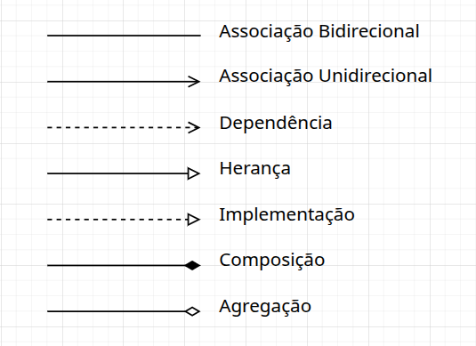

# Diagrama de Classes UML

Este repositório compila conhecimentos necessários para ler e desenvolver um **diagrama de classes UML**.

## Índice

1. [Introdução](src/main/com/introducao/INTRODUCAO.md)
2. [Associações](src/main/com/associacoes/ASSOCIACOES.md)
   1. [Associação bidirecional](src/main/com/associacao_bidirecional/ASSOCIACAO_BIDIRECIONAL.md)
   2. [Associação unidirecional](src/main/com/associacao_unidirecional/ASSOCIACAO_UNIDIRECIONAL.md)
   3. [Dependência](src/main/com/dependencia/DEPENDENCIA.md)
   4. [Herança](src/main/com/heranca/HERANCA.md)
   5. [Implementação](src/main/com/implementacao/IMPLEMENTACAO.md)
   6. [Composição](src/main/com/composicao/COMPOSICAO.md)
   7. [Agregação](src/main/com/agregacao/AGRECACAO.md)
3. [Multiplicidade](src/main/com/multiplicidade/MULTIPLICIDADE.md)
4. [Pacores](src/main/com/pacotes/PACOTES.md)

## Referências

- [IBM - Diagrama de classes UML](https://www.ibm.com/docs/pt-br/rsas/7.5.0?topic=structure-class-diagrams)
- [IBM - Relacionamentos em diagramas de classe UML](https://www.ibm.com/docs/pt-br/rsas/7.5.0?topic=diagrams-relationships-in-class)