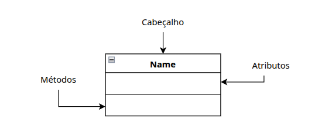
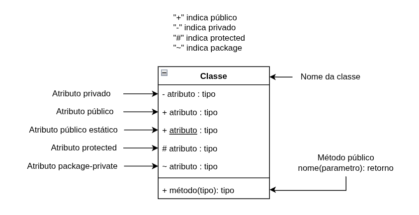
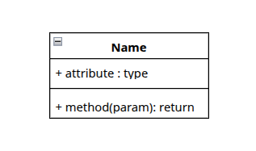
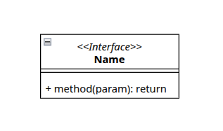
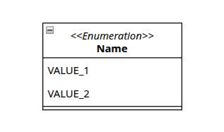

### [Índice](../../../../README.md)

# Introdução

Antes de modelar relacionamentos, é necessário entender a sintaxe básica e como um diagrama é estruturado.

## Estrutura padrão

Toda classe possui três campos:
- Cabeçalho
- Atributos
- Métodos

Ao descrever um atributo ou método, você pode utilizar os prefixos **"+"** ou **"-"** para indicar modificadores de acesso **público** ou **privado**, respectivamente.
Observe as imagens abaixo para melhor entendimento.

## Tipos de classe

- **Classe**

    Esse é o tipo padrão, que representa uma classe comum. 

  
   

---

- **Interface**
    
    Uma interface é somente o contrato de uma classe, sem atributos, somente métodos abstratos públicos.

  

---

- **Enum**
    
    Esse tipo é utilizado para manter uma lista de valores imutáveis.

  

> Nota: métodos construtores padrões (público e sem argumentos/todos os argumentos) não são obrigatórios na modelagem UML.

### [Próximo (Associações)](../associacoes/ASSOCIACOES.md)
